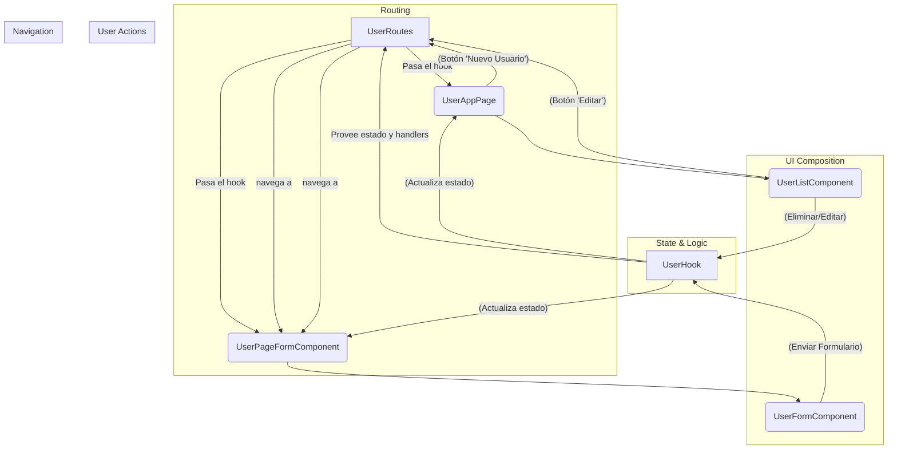

# 📝 UserApp: Gestión de Usuarios con React y React Router

Este proyecto es una aplicación web para la gestión de usuarios (CRUD) construida con React y Vite. La aplicación, que ahora utiliza **React Router**, permite a los usuarios autenticarse, y después añadir, ver, editar y eliminar usuarios a través de una navegación fluida entre páginas dedicadas.

## ✨ Características Mejoradas

- **Módulo de Login**: Permite a los usuarios autenticarse para acceder a la aplicación.
- **Navegación con React Router**: Se ha implementado un sistema de rutas para navegar entre la lista de usuarios y los formularios.
- **Página de Registro de Usuario**: El formulario para añadir nuevos usuarios ahora se encuentra en una página dedicada (`/users/registro`), reemplazando el popup modal anterior.
- **Página de Edición de Usuario**: Al editar un usuario, se navega a una ruta específica (`/users/registro/:id`) con el formulario precargado con sus datos.
- **Listar y Eliminar usuarios**: La lista de usuarios se mantiene como la página principal, desde donde se puede eliminar o navegar a la edición.
- **Notificaciones**: Usa `SweetAlert2` para mostrar notificaciones amigables.
- **Buenas prácticas**: Configurado con ESLint, Prettier y Husky para asegurar la calidad y consistencia del código.

## 🚀 Tecnologías Utilizadas

- **[React](https://reactjs.org/)**: Biblioteca para construir interfaces de usuario.
- **[React Router](https://reactrouter.com/)**: Para la navegación y el enrutamiento en la aplicación.
- **[Vite](https://vitejs.dev/)**: Herramienta de desarrollo frontend rápida.
- **[React Bootstrap](https://react-bootstrap.github.io/)**: Componentes de Bootstrap para React.
- **[SweetAlert2](https://sweetalert2.github.io/)**: Notificaciones y modales personalizables.
- **[ESLint](https://eslint.org/)**: Linter para identificar y corregir problemas en el código.
- **[Prettier](https://prettier.io/)**: Formateador de código para un estilo consistente.
- **[Husky](https://typicode.github.io/husky/)**: Herramienta para automatizar tareas con Git hooks.

## 📂 Módulos del Proyecto

La estructura del proyecto se ha actualizado para incluir la gestión de rutas:

- **`components`**: Contiene los componentes de React.
  - **`layout`**: Componentes de la estructura de la página (ej. `BarraNavegacion`).
  - **`UserFormComponent`**: Formulario para crear/editar usuarios.
  - **`UserListComponent`**: Tabla que muestra la lista de usuarios.
  - **`UserPageFormComponent`**: Componente de página que envuelve el formulario y maneja la lógica de obtener el usuario a editar.
- **`hooks`**: Hooks personalizados que encapsulan la lógica de estado (`UserHook.js`, `UseLoginHook.js`).
- **`reducers`**: Funciones reductoras para manejar el estado (`UserReducer.js`, `LoginReducer.js`).
- **`routes`**: **(Nuevo)** Contiene la configuración de las rutas de la aplicación (`UserRoutes.jsx`).
- **`service`**: Lógica de negocio y comunicación con fuentes de datos (`UserService.js`).
- **`const`** y **`data`**: Almacenan constantes y datos iniciales.

## 📊 Diagrama de Flujo de Datos (con React Router)

El siguiente diagrama ilustra la nueva arquitectura con React Router:



### Explicación del Diagrama

1.  **`UserRoutes`**: Gestiona las rutas, mostrando `UserAppPage` (lista) o `UserPageFormComponent` (formulario) según la URL. Recibe la lógica del `UserHook` y la distribuye.
2.  **`UserHook`**: Sigue siendo el centro de la lógica de negocio y el estado de los usuarios.
3.  **`UserAppPage`**: Muestra la `UserListComponent` y el botón para navegar a la página de creación.
4.  **`UserPageFormComponent`**: Contiene el `UserFormComponent` y se encarga de la lógica de crear un usuario nuevo o cargar los datos de uno existente para editarlo.
5.  **Navegación**: Las acciones como "Nuevo Usuario" o "Editar" ahora disparan un cambio de ruta a través de `UserRoutes`, en lugar de abrir un modal.

## 🛠️ Instalación y Uso

Sigue estos pasos para ejecutar el proyecto en tu máquina local:

1.  **Clona el repositorio**

    ```bash
    git clone <URL_DEL_REPOSITORIO>
    cd 6-user-app
    ```

2.  **Instala las dependencias**

    ```bash
    npm install
    ```

3.  **Ejecuta el servidor de desarrollo**

    ```bash
    npm run dev
    ```

    La aplicación estará disponible en `http://localhost:5173` (o el puerto que indique Vite).

## 📜 Scripts Disponibles

En el archivo `package.json` encontrarás los siguientes scripts:

- `npm run dev`: Inicia el servidor de desarrollo de Vite.
- `npm run build`: Compila la aplicación para producción.
- `npm run lint`: Ejecuta ESLint para analizar el código en busca de errores.
- `npm run format`: Formatea todo el código del proyecto con Prettier.
- `npm run preview`: Sirve la versión de producción de la aplicación localmente.

## 🤝 Contribuciones

Las contribuciones son bienvenidas. Si quieres mejorar este proyecto, por favor, sigue estos pasos:

1.  Haz un Fork del proyecto.
2.  Crea una nueva rama (`git checkout -b feature/nueva-caracteristica`).
3.  Haz tus cambios y haz commit (`git commit -m 'Añade nueva característica'`).
4.  Haz push a la rama (`git push origin feature/nueva-caracteristica`).
5.  Abre un Pull Request.
