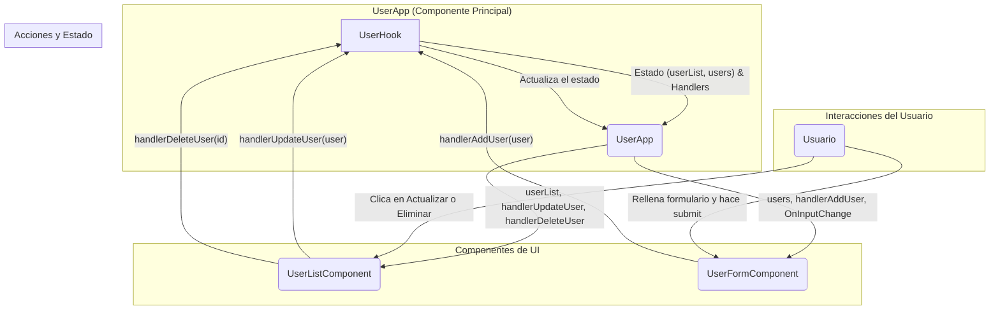

# 📝 UserApp: Gestión de Usuarios con React

Este proyecto es una aplicación web para la gestión de usuarios (CRUD: Crear, Leer, Actualizar, Eliminar) construida con React y Vite. La aplicación permite a los usuarios añadir, ver, editar y eliminar usuarios de una lista.

## ✨ Características

- **Módulo de Login**: Permite a los usuarios autenticarse para acceder a la aplicación.
- **Añadir nuevos usuarios**: A través de un formulario controlado.
- **Listar usuarios**: Muestra la lista de usuarios en una tabla.
- **Actualizar usuarios**: Permite editar la información de un usuario existente.
- **Eliminar usuarios**: Elimina un usuario de la lista con una confirmación.
- **Notificaciones**: Usa `SweetAlert2` para mostrar notificaciones amigables.
- **Buenas prácticas**: Configurado con ESLint, Prettier y Husky para asegurar la calidad y consistencia del código.

## 🚀 Tecnologías Utilizadas

- **[React](https://reactjs.org/)**: Biblioteca para construir interfaces de usuario.
- **[Vite](https://vitejs.dev/)**: Herramienta de desarrollo frontend rápida.
- **[React Bootstrap](https://react-bootstrap.github.io/)**: Componentes de Bootstrap para React.
- **[SweetAlert2](https://sweetalert2.github.io/)**: Notificaciones y modales personalizables.
- **[ESLint](https://eslint.org/)**: Linter para identificar y corregir problemas en el código.
- **[Prettier](https://prettier.io/)**: Formateador de código para un estilo consistente.
- **[Husky](https://typicode.github.io/husky/)**: Herramienta para automatizar tareas con Git hooks.

## 📂 Módulos del Proyecto

El proyecto está estructurado en los siguientes módulos dentro de la carpeta `src`:

- **`components`**: Contiene los componentes de React que conforman la interfaz de usuario.
  - **`layout`**: Componentes relacionados con la estructura de la página (ej. `BarraNavegacion`).
  - **`UI`**: Componentes reutilizables de la interfaz de usuario (ej. `UserModalFormComponent`).
- **`const`**: Almacena constantes utilizadas en la aplicación (ej. `UserConst.js`).
- **`data`**: Contiene datos iniciales o de prueba (ej. `User.js`).
- **`hooks`**: Hooks personalizados de React para encapsular lógica de estado y efectos (ej. `UserHook.js`).
- **`reducers`**: Funciones reductoras para manejar el estado de la aplicación con `useReducer` (ej. `UserReducer.js`, `LoginReducer.js`).
- **`service`**: Lógica de negocio y comunicación con APIs o fuentes de datos (ej. `UserService.js`).

## 📊 Diagrama de Flujo de Datos

El siguiente diagrama ilustra cómo fluyen los datos y las acciones a través de los componentes de la aplicación:



### Explicación del Diagrama

1.  **`UserApp`**: Es el componente principal que orquesta todo. Utiliza el hook `UserHook` para manejar la lógica y el estado.
2.  **`UserHook`**: Es un hook personalizado que centraliza toda la lógica de negocio (añadir, actualizar, eliminar usuarios) y el manejo del estado (`userList`, `users`).
3.  **`UserListComponent`**: Muestra la lista de usuarios. Recibe la lista y los `handlers` para actualizar y eliminar usuarios desde `UserApp`.
4.  **`UserFormComponent`**: Es el formulario para añadir o editar usuarios. Recibe el estado del usuario actual y los `handlers` para añadir/actualizar y manejar los cambios en los inputs.
5.  **Usuario**: Interactúa con los componentes `UserListComponent` y `UserFormComponent` para disparar las acciones.

## 🛠️ Instalación y Uso

Sigue estos pasos para ejecutar el proyecto en tu máquina local:

1.  **Clona el repositorio**

    ```bash
    git clone <URL_DEL_REPOSITORIO>
    cd 6-user-app
    ```

2.  **Instala las dependencias**

    ```bash
    npm install
    ```

3.  **Ejecuta el servidor de desarrollo**

    ```bash
    npm run dev
    ```

    La aplicación estará disponible en `http://localhost:5173` (o el puerto que indique Vite).

## 📜 Scripts Disponibles

En el archivo `package.json` encontrarás los siguientes scripts:

- `npm run dev`: Inicia el servidor de desarrollo de Vite.
- `npm run build`: Compila la aplicación para producción.
- `npm run lint`: Ejecuta ESLint para analizar el código en busca de errores.
- `npm run format`: Formatea todo el código del proyecto con Prettier.
- `npm run preview`: Sirve la versión de producción de la aplicación localmente.

## 🤝 Contribuciones

Las contribuciones son bienvenidas. Si quieres mejorar este proyecto, por favor, sigue estos pasos:

1.  Haz un Fork del proyecto.
2.  Crea una nueva rama (`git checkout -b feature/nueva-caracteristica`).
3.  Haz tus cambios y haz commit (`git commit -m 'Añade nueva característica'`).
4.  Haz push a la rama (`git push origin feature/nueva-caracteristica`).
5.  Abre un Pull Request.
